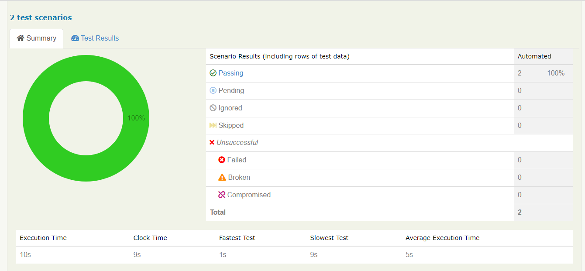

# RestAssured-Weatherbit-Automation

<!-- ABOUT THE PROJECT -->
## About The Project


</div>
Here is my project using Rest Assured to Automate API testing on api.weatherbit.io. I also implement gherkin languange as main feature of this test. So it's quite easy to understand what to test and how the test work. 


### Built With

* [Java 1.8](https://www.oracle.com/java/technologies/downloads/)
* [Intellij IDEA]()
* [Maven]()


<!-- GETTING STARTED -->
## Getting Started

To get a local copy up and running follow these simple example steps.


### Installation

#### Method 1: Trough terminal (Maven Should be Installed)

Clone the repo
   ```sh
   git clone https://github.com/havidn/RestAssured-Weatherbit-Automation.git
   ```
Run Maven command
   ```sh
   mvn clean verify
   ```

<!-- USAGE EXAMPLES -->
## Usage

```sh
Feature: Weatherbit API Automation
  Scenario: Get Current Weather Data
    Given User set lat to 40.730610 and lon -73.935242 and token "86eb0c93f440431fb6a43f23ee90fc28"
    When User send request get Current Weather
    Then Should return 200 OK
    And Response body should contain State Code "NY"
    And Get Weather  json Schema Validator
```
  

<!-- CONTACT -->
## Contact
Havid Nursahgandi - [LinkedIn](https://www.linkedin.com/in/havid-nursahgandi/) - havidnursahgandi@gmail.com

